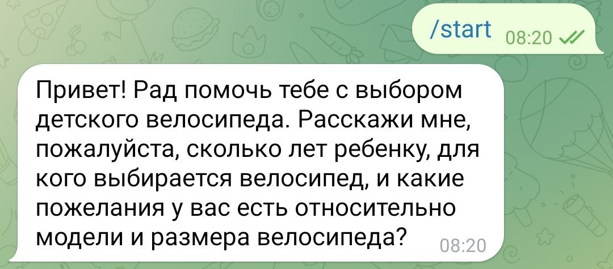

# Отчёт о проекте «LLM-ассистент — Продавец детских велосипедов»

## Краткое описание
Проект — Telegram-бот, использующий LLM для роли продавца детских велосипедов. Цель — быстро проверить гипотезу о полезности консультанта и собрать обратную связь от пользователей. Решение выполнено по принципам KISS и YAGNI: только необходимая логика, фокус на простоте запуска и тестирования.

## Роль ИИ-ассистента
**Роль:** продавец детских велосипедов. 
**Обоснование:** это нишевый сценарий с понятными пользовательскими запросами (подбор велосипеда, консультации по доставке и уходу). Роль позволяет проверить полезность LLM в прикладной сфере и оценить потенциал продаж/консультаций.

## Реализованные возможности
- [x] Telegram-бот на aiogram с polling.
- [x] Системный промпт и персонализация под роль продавца.
- [x] Интеграция с Openrouter (через openai AsyncOpenAI) для генерации ответов.
- [x] Конфигурация через `.env` и `config.py` (ключи, модель, промпт).
- [x] Базовое логгирование и обработка ошибок LLM.
- [x] Обработка длинных ответов с разбиением под ограничения Telegram.
- [x] Сценарии консультаций (подбор велосипеда, доставка, акции) через системный промпт.

## Технологический стек
- Python 3.11
- aiogram 3.x
- openai (AsyncOpenAI) + Openrouter API
- python-dotenv
- logging (стандартный модуль)

## Инструменты AI-driven разработки
- **AI-coding IDE:** Cursor (GPT-5 Codex агент).
- **Использованные LLM-модели:**
  - GPT-5 Codex (IDE-ассистент для проектирования, кода и документации).
  - Openrouter `openai/gpt-3.5-turbo` (генерация ответов бота и проверка сценариев).

## Скриншот работы

## Процесс разработки: вызовы и решения
1. **Установка зависимостей на Windows:** проблемы с aiohttp/pydantic-core решены переходом на aiogram 3.x и обновлением httpx.
2. **Интеграция с Openrouter:** адаптация под новый синтаксис openai>=1.x и подключение AsyncOpenAI клиента.
3. **Работа с .env:** перенос `load_dotenv()` в `config.py`, чтобы переменные загружались до использования.
4. **Ограничения Telegram:** добавлено разбиение длинных ответов на части, чтобы избежать ошибки `message is too long`.
5. **Сценарии в промпте:** сценарии описаны в системном промпте без дополнительной логики, что сохранило простоту MVP.

## Новые инсайты при AI-driven разработке
- Важность выбора библиотеки/версии для минимизации проблем установки (aiogram 3.x на Windows).
- Нужно учитывать изменения API (openai 1.x) и быстро адаптировать код под новые клиенты.
- Организация конфигурации (config.py + dotenv) обеспечивает простую смену параметров.
- Простые сценарии можно эффективно реализовать через системный промпт, если не усложнять логику.
- Мгновенная обратная связь от IDE-ассистента помогает держать фокус на KISS/YAGNI и ускоряет итерации.

## (Опционально) Ссылка на работающего бота
Добавьте ссылку (t.me/... или иная) после деплоя бота в публичный доступ.
