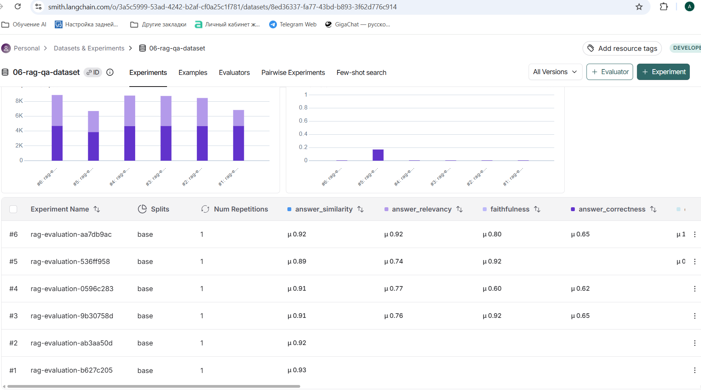

# Отчёт о выполнении задания

## Название проекта и описание

**RAG-ассистент Сбербанка**

Telegram-бот с RAG (Retrieval-Augmented Generation) для ответов на вопросы по документам Сбербанка о кредитах и вкладах. Система использует LangChain для реализации RAG-пайплайна, автоматически индексирует PDF документы и готовые Q&A пары из JSON, поддерживает контекстный диалог с query transformation и предоставляет оценку качества через RAGAS метрики.

## Вариант задания

**Базовый вариант**

## Используемые модели и провайдеры

### Для RAG системы

**Провайдер: Fireworks**

- **Основная LLM:** `accounts/fireworks/models/gpt-oss-120b` (для генерации ответов)
- **LLM для query transform:** `accounts/fireworks/models/gpt-oss-120b` (для трансформации запросов с учетом истории)
- **Embeddings:** `intfloat/multilingual-e5-base` (HuggingFace провайдер)

### Для RAGAS evaluation

- **LLM для метрик:** `gpt-4o` (по умолчанию, настраивается через `RAGAS_LLM_MODEL`)
- **Embeddings для метрик:** `text-embedding-3-large` (по умолчанию, настраивается через `RAGAS_EMBEDDING_MODEL`)
- **Провайдер:** OpenAI (по умолчанию) или HuggingFace (настраивается через `RAGAS_EMBEDDING_PROVIDER`)

## Создание и загрузка датасета

### Метод создания

Датасет создан **комбинированным методом**:

1. **Автоматический синтез из PDF** (4 примера):
   - Загружаются PDF документы из директории `data/`
   - Документы разбиваются на чанки (chunk_size=500, overlap=50)
   - Выбираются репрезентативные чанки (по умолчанию 2 на файл)
   - LLM генерирует вопросы и ответы на основе каждого чанка
   - Используется модель `accounts/fireworks/models/gpt-oss-120b` (настроена в `dataset_synthesizer.py`)

2. **Загрузка готовых Q&A пар из JSON** (2 примера):
   - Загружаются готовые Q&A пары из файла `sberbank_help_documents.json`
   - Выполняется случайная выборка (по умолчанию 2 пары)

### Размер датасета

**Всего: 6 примеров**
- Синтезированных из PDF: 4
- Из JSON файла: 2

### Скриншот датасета в LangSmith



### Примеры Q&A пар из датасета

**Пример 1 (синтезированный из PDF):**
```json
{
  "question": "Какие основные разделы включены в Общие условия предоставления, обслуживания и погашения потребительского кредита?",
  "ground_truth": "В Общих условиях указаны: 1) Кредит, 2) Договор между Заемщиком (или созаемщиками) и Кредитором, 3) Стороны договора, 4) Обеспечение по кредиту, 5) Порядок заключения договора, 6) Акцепт индивидуальных условий кредитования (ИУ) Кредитором.",
  "contexts": ["Содержание Общих условий предоставления..."],
  "metadata": {
    "source": "data\\ouk_potrebitelskiy_kredit_lph.pdf",
    "page": 0,
    "type": "synthesized"
  }
}
```

**Пример 2 (из JSON):**
```json
{
  "question": "Как не пропустить конец беспроцентного периода?",
  "ground_truth": "Посмотреть сроки беспроцентного периода, дату и сумму ближайшего платежа, а также кредитный лимит можнов разделе «Задолженность» в СберБанк Онлайн.",
  "contexts": ["Категория: Вопросы о кредитных картах..."],
  "metadata": {
    "source": "sberbank_help_documents.json",
    "page": null,
    "type": "from_json",
    "category": "Вопросы о кредитных картах",
    "url": "https://www.sberbank.ru/ru/person/help/ccards_faq/3029?question=4976"
  }
}
```

## Оценка качества через RAGAS

### Используемые метрики

Для оценки качества RAG системы используются **6 метрик RAGAS**:

1. **Faithfulness (Обоснованность)** - проверяет, что ответ не содержит галлюцинаций и основан только на retrieved документах
2. **Answer Relevancy (Релевантность ответа)** - оценивает, насколько ответ релевантен заданному вопросу (strictness=1)
3. **Answer Correctness (Правильность ответа)** - проверяет соответствие ответа ground truth эталону
4. **Answer Similarity (Похожесть на эталон)** - семантическая похожесть ответа на эталонный ответ
5. **Context Recall (Полнота контекста)** - оценивает, содержат ли retrieved документы всю информацию, необходимую для правильного ответа
6. **Context Precision (Точность поиска)** - проверяет релевантность retrieved документов к вопросу

### Реализация evaluation

Evaluation выполняется через команду `/evaluate_dataset` в Telegram боте:

1. Запускается эксперимент в LangSmith с `blocking=False`
2. Собираются данные (question, answer, contexts, ground_truth) из runs
3. Выполняется batch evaluation через RAGAS
4. Результаты загружаются в LangSmith как feedback

## Выводы

### Результаты evaluation

Результаты evaluation для датасета `06-rag-qa-dataset` (6 примеров обработано):

| Метрика | Значение | Оценка |
|---------|----------|--------|
| **Обоснованность (нет галлюцинаций)** (Faithfulness) | 0.800 | 🟢 Отличный |
| **Релевантность ответа** (Answer Relevancy) | 0.918 | 🟢 Отличный |
| **Правильность ответа** (Answer Correctness) | 0.649 | 🟡 Хороший |
| **Похожесть на эталон** (Answer Similarity) | 0.918 | 🟢 Отличный |
| **Полнота контекста** (Context Recall) | 1.000 | 🟢 Идеальный |
| **Точность поиска** (Context Precision) | 1.000 | 🟢 Идеальный |

**Интерпретация:**
- 🟢 0.8+ отличный результат
- 🟡 0.6-0.8 хороший результат
- 🔴 <0.6 требует улучшений

### Главные инсайты о качестве RAG системы

На основе результатов evaluation и структуры проекта:

1. **Архитектура RAG:**
   - Используется query transformation для улучшения поисковых запросов с учетом истории диалога
   - Retriever настроен на k=3 (поиск 3 наиболее релевантных чанков)
   - Поддержка контекстного диалога через сохранение истории в формате LangChain Messages

2. **Индексация документов:**
   - Автоматическая обработка PDF и JSON документов
   - Разбиение на чанки размером 500 символов с перекрытием 50 символов
   - Поддержка разных провайдеров embeddings (OpenAI, HuggingFace)

3. **Evaluation pipeline:**
   - Автоматический синтез тестовых датасетов из документов
   - Интеграция с LangSmith для хранения датасетов и traces
   - Комплексная оценка качества через 6 RAGAS метрик

4. **Анализ результатов метрик:**

   **Сильные стороны:**
   - **Context Recall (1.000)** и **Context Precision (1.000)** - идеальные результаты! Система извлекает все необходимые документы и только релевантные
   - **Answer Similarity (0.918)** - очень высокая семантическая похожесть ответов на эталонные
   - **Answer Relevancy (0.918)** - ответы высоко релевантны заданным вопросам
   - **Faithfulness (0.800)** - хорошая обоснованность, ответы основаны на retrieved документах

   **Области для улучшения:**
   - **Answer Correctness (0.649)** - самая низкая метрика, требует внимания:
     - Ответы системы не всегда точно соответствуют эталонным ответам по фактологической точности
     - Рекомендации:
       - Улучшить промпты для более точной генерации ответов
       - Проверить качество ground truth в датасете (возможно, некоторые эталонные ответы слишком специфичны)
       - Рассмотреть использование более точной модели для генерации ответов
       - Добавить post-processing для проверки фактологической точности

5. **Технические улучшения:**
   - Обработка RateLimitError при evaluation (требуется добавление retry логики)
   - Улучшение извлечения данных из LangSmith runs (исправлено в коде)
   - Оптимизация синтеза датасетов (улучшено логирование ошибок)

